Local ancestry estimation
================
Erick Navarro
2025-Oct

## Background

This file documents the analysis conducted to estimate the local
ancestry of the variant of interest rs5848 (chr17:44,352,776 in hg38,
chr17:44352876 in hg19), which is a variant involved in Fronto Temporal
Dementia. The analysis was conducted in Sockeye.

## Subsetting

Since we are only interested in the local ancestry of a single variant,
we will subset the data to a +/- 10Mb window from the variant, which is
the range chr17:34,352,776-54,352,776. To do so, I used
[bcftools](https://samtools.github.io/bcftools/bcftools.html)

``` bash
module load CVMFS_CC # Full list of available software here: https://docs.alliancecan.ca/wiki/Available_software ; https://confluence.it.ubc.ca/display/UARC/Accessing+Compute+Canada+Software+Stack
module load gcc/9.3.0
module load intel/2020.1.217
module load bcftools/1.9

# Subset
bcftools view -Oz -r chr17:34352776-54352776 -o /scratch/st-kdkortha-1/enavarro/pgrn_local_ancestry/data/chr17_subset_v10.vcf.gz /scratch/st-kdkortha-1/enavarro/pgrn_local_ancestry/data/gcad.qc.compact_filtered.r4.wgs.36361.GATK.2023.06.06.biallelic.genotypes.chr17.ALL.vcf.bgz 

# Index output file 
bcftools index /scratch/st-kdkortha-1/enavarro/pgrn_local_ancestry/data/chr17_subset_v10.vcf.gz
```

## Phasing

The next step is to phase the genotyping data. To do so, we will use
[SHAPEIT](https://mathgen.stats.ox.ac.uk/genetics_software/shapeit/shapeit.html#home),
which is a fast and accurate method for estimation of haplotypes (aka
phasing) from genotype or sequencing data ([paper
link](http://www.nature.com/nmeth/journal/v9/n2/full/nmeth.1785.html/)).

### Shapeit 4

I will try using directly the hg38 reference directly that I got from
here
(<http://ftp.1000genomes.ebi.ac.uk/vol1/ftp/data_collections/1000G_2504_high_coverage/working/20201028_3202_phased/>)

The genetic map was obtained from here
<https://github.com/odelaneau/shapeit4/tree/master/maps> . This site is
recommended in the [shapeit4
documentation](https://odelaneau.github.io/shapeit4/#documentation)

Now I will run the script

``` bash
#!/bin/bash
#SBATCH --time=72:00:00 # Request 24 hours of runtime
#SBATCH --account=st-kdkortha-1 # Specify your allocation code
#SBATCH --nodes=1 # Request 1 node
#SBATCH --ntasks=1 # Request 1 task
#SBATCH --mem=64G # Request 16 GB of memory
#SBATCH --cpus-per-task=8
#SBATCH --job-name=phase_chr17 # Specify the job name
#SBATCH -e shapeit4_phase-%j.err # Specify the error file. The %j will be replaced by the Slurm job id.
#SBATCH -o shapeit4_phase-%j.out # Specify the output file
#SBATCH --mail-user=erick.navarrodelgado@bcchr.ca  # Email address for job notifications
#SBATCH --mail-type=ALL

module load CVMFS_CC 
module load gcc/9.3.0  openmpi/4.0.3
module load shapeit4/4.2.1

# Phasing
cd /scratch/st-kdkortha-1/enavarro/pgrn_local_ancestry/data/

shapeit4 --input chr17_subset_v10.vcf.gz --map chr17.b38.gmap.gz --region chr17 --reference CCDG_14151_B01_GRM_WGS_2020-08-05_chr17.filtered.shapeit2-duohmm-phased.vcf.gz --output chr17_subset_v10_hg38_phased.vcf.gz --thread 8
```

## Local ancestry estimation

From the Tractor
[tutorial](https://atkinson-lab.github.io/Tractor-tutorial/Rfmix.html) :

Here we use Rfmix to perform local ancestry inference, given its high
accuracy in multi-way admixed populations. RFmix takes the following
argument and will produce 4 files ASW.deconvoluted.fb.tsv,
ASW.deconvoluted.msp.tsv, ASW.deconvoluted.rfmix.Q,
ASW.deconvoluted.sis.tsv, most of which will be used in the downstream
analysis. This argument points to our cohort file, the reference panel,
a map indicating which population each reference individual pertains to,
a recombination map for the relevant chromosome, and the location where
output should be deposited.

Requirements

- A phased VCF/BCF file containing “query” haplotypes which are to be
  analyzed.
- A phased VCF/BCF file containing reference haplotypes (in any order)
- A reference sample map file matching reference samples to their
  respective reference populations
- A genetic map file
- All files mapped or referenced to the same genome assembly
- All diploid genotypes must be phase resolved

In addition to the above, you must at minimum also specify a basename
(prefix) for output files, and the chromosome to analyze from the
VCF/BCF inputs, even if they contain only one chromosome If BCF files
are used, bcftools must be installed and available in the PATH
environment setting VCF/BCF files may be gzip compressed, and should be
indexed using bcftools

So, we need to index the phased vcf first

``` bash
module load CVMFS_CC # Full list of available software here: https://docs.alliancecan.ca/wiki/Available_software ; https://confluence.it.ubc.ca/display/UARC/Accessing+Compute+Canada+Software+Stack
module load gcc/9.3.0
module load intel/2020.1.217
module load bcftools/1.9

cd data

bcftools index chr17_subset_v10_hg38_phased.vcf.gz 
```

### Formatting files

Some of the files we have are not in the required order.

Genetic map file looks like this:

pos chr cM 163252 17 0 191293 17 0.105037 201297 17 0.142532 202676 17
0.146088 203220 17 0.147488

When according to the instructions:

The genetic map file is tab delimited text containing at least 3
columns. The first 3 columns are intepreted as chromosome, physical
position in bp, genetic position in cM. Any number of columns or other
information may follow, it is ignored. The chromosome column is a string
token (which may be an string of digits) that must match those used in
the VCF/BCF inputs. The genetic map file should contain the map for the
entire genome (all chromosomes). Blank lines and lines beginning with a
‘\#’ are ignored.

``` bash
cd data 
zcat data/chr17.b38.gmap.gz | awk -F'\t' -v OFS="\t" '{ print $2, $1, $3}' | tail -n +2 | awk '{print (NR>0 ? "chr" : "") $0}' > data/chr17.b38_rfmix.gmap.tsv

# This is also adding "chr" at the beginning, since it only says 17 and not chr17
```

Similarly, the sample file needs to be like this:

It is tab delimited text with at least two columns. The first column
gives the sample name or identifier, which must match the one used in
the reference VCF/BCF. The second column is a string naming a
subpopulation and may contain spaces (e.g., “European”, or “East
African”). RFMIX will assign all distinct subpopulation names it finds
in the sample map file an index number, in alphabetical order. The
output will reference by index number; the order is given at the top of
the output files. Blank lines and lines beginning with a ‘\#’ are
ignored in the sample map file.

And it looks like this:

FamilyID SampleID FatherID MotherID Sex Population Superpopulation
HG00096 HG00096 0 0 1 GBR EUR HG00097 HG00097 0 0 2 GBR EUR HG00099
HG00099 0 0 2 GBR EUR HG00100 HG00100 0 0 2 GBR EUR HG00101 HG00101 0 0
1 GBR EUR HG00102 HG00102 0 0 2 GBR EUR

``` bash
awk -F' ' -v OFS="\t" '{ print $2, $7}'  data/20130606_g1k_3202_samples_ped_population.txt > data/sample_file_rfmix.tsv
```

### Run the analysis

Now I will run the anaysis

``` bash
#!/bin/bash
#SBATCH --time=72:00:00 # Request 24 hours of runtime
#SBATCH --account=st-kdkortha-1 # Specify your allocation code
#SBATCH --nodes=1 # Request 1 node
#SBATCH --ntasks=1 # Request 1 task
#SBATCH --mem=160G # Request 160 GB of memory
#SBATCH --cpus-per-task=20
#SBATCH --job-name=rfmix_chr17 # Specify the job name
#SBATCH -e rfmix_run-%j.err # Specify the error file. The %j will be replaced by the Slurm job id.
#SBATCH -o rfmix_run-%j.out # Specify the output file
#SBATCH --mail-user=erick.navarrodelgado@bcchr.ca  # Email address for job notifications
#SBATCH --mail-type=ALL

module load CVMFS_CC 
module load gcc/9.3.0
module load intel/2020.1.217
module load bcftools/1.9

cd /scratch/st-kdkortha-1/enavarro/pgrn_local_ancestry

./rfmix-master/rfmix -f data/chr17_subset_v10_hg38_phased.vcf.gz -r data/CCDG_14151_B01_GRM_WGS_2020-08-05_chr17.filtered.shapeit2-duohmm-phased.vcf.gz -m data/sample_file_rfmix.tsv -g data/chr17.b38_rfmix.gmap.tsv -o results/rfmix_results --chromosome=chr17 --n-threads=40
```

\[<ericknav@se012> pgrn_local_ancestry\]\$ ./rfmix-master/rfmix -f
data/chr17_subset_v10_hg38_phased.vcf.gz -r
data/CCDG_14151_B01_GRM_WGS_2020-08-05_chr17.filtered.shapeit2-duohmm-phased.vcf.gz
-m data/sample_file_rfmix.tsv -g data/chr17.b38_rfmix.gmap.tsv -o
results/rfmix_results –chromosome=chr17

RFMIX v2.03-r0 - Local Ancestry and Admixture Inference (c) 2016, 2017
Mark Koni Hamilton Wright Bustamante Lab - Stanford University School of
Medicine Based on concepts developed in RFMIX v1 by Brian Keith Maples,
et al.

This version is licensed for non-commercial academic research use only
For commercial licensing, please contact <cdbadmin@stanford.edu>

— For use in scientific publications please cite original publication —
Brian Maples, Simon Gravel, Eimear E. Kenny, and Carlos D. Bustamante
(2013). RFMix: A Discriminative Modeling Approach for Rapid and Robust
Local-Ancestry Inference. Am. J. Hum. Genet. 93, 278-288

## Tractor

Now I will run
[Tractor](https://www.nature.com/articles/s41588-020-00766-y) to conduct
an ancestry-specific association analysis. I will be following their
[tutorial](https://atkinson-lab.github.io/Tractor-tutorial/). The first
step after phasing is to extract the tracts and format the results for
Tractors analysis.

### Extract tracts

``` bash
# Clone Tractor repo 
cd /scratch/st-kdkortha-1/enavarro/pgrn_local_ancestry/
git clone https://github.com/Atkinson-Lab/Tractor.git
```

I will now create a script to run the track extraction

``` bash
#!/bin/bash
#SBATCH --time=72:00:00 # Request 24 hours of runtime
#SBATCH --account=st-kdkortha-1 # Specify your allocation code
#SBATCH --nodes=1 # Request 1 node
#SBATCH --ntasks=1 # Request 1 task
#SBATCH --mem=160G # Request 160 GB of memory
#SBATCH --cpus-per-task=20
#SBATCH --job-name=tractor_extract_tracks # Specify the job name
#SBATCH -e tracks_ext-%j.err # Specify the error file. The %j will be replaced by the Slurm job id.
#SBATCH -o tracks_ext-%j.out # Specify the output file
#SBATCH --mail-user=erick.navarrodelgado@bcchr.ca  # Email address for job notifications
#SBATCH --mail-type=ALL

cd /scratch/st-kdkortha-1/enavarro/pgrn_local_ancestry/Tractor/scripts
python3 extract_tracts.py --vcf ../../data/chr17_subset_v10_hg38_phased.vcf.gz --msp ../../results/rfmix_results.msp.tsv --num-ancs 5
```

INFO (**main** 96): \# Running script version : 1.2.0 INFO (**main**
97): \# VCF File : ../../data/chr17_subset_v10_hg38_phased.vcf.gz INFO
(**main** 98): \# Prefix of output file names :
chr17_subset_v10_hg38_phased INFO (**main** 99): \# VCF File is
compressed? : True INFO (**main** 100): \# Number of Ancestries in VCF :
5 INFO (**main** 101): \# Output Directory : None INFO (**main** 109):
Creating output files for 5 ancestries INFO (**main** 124): Iterating
through VCF file

### Create phenotype file

Ben sent me a phenotype file. I will open it, explore the variables of
interest and select the needed information.

``` r
library(tidyverse)
```

    ## ── Attaching core tidyverse packages ──────────────────────── tidyverse 2.0.0 ──
    ## ✔ dplyr     1.1.4     ✔ readr     2.1.5
    ## ✔ forcats   1.0.0     ✔ stringr   1.5.1
    ## ✔ ggplot2   3.5.2     ✔ tibble    3.3.0
    ## ✔ lubridate 1.9.3     ✔ tidyr     1.3.1
    ## ✔ purrr     1.1.0     
    ## ── Conflicts ────────────────────────────────────────── tidyverse_conflicts() ──
    ## ✖ dplyr::filter() masks stats::filter()
    ## ✖ dplyr::lag()    masks stats::lag()
    ## ℹ Use the conflicted package (<http://conflicted.r-lib.org/>) to force all conflicts to become errors

``` r
library(here)
```

    ## here() starts at /Users/ericknavarro/Documents/MScBioinfoUBC/ben_life

``` r
library(DataExplorer)
library(mice)
```

    ## 
    ## Attaching package: 'mice'
    ## 
    ## The following object is masked from 'package:stats':
    ## 
    ##     filter
    ## 
    ## The following objects are masked from 'package:base':
    ## 
    ##     cbind, rbind

``` r
metadata <- read.csv("~/Documents/MScBioinfoUBC/ben_life/ADSPIntegratedPhenotypes_DS_2023.08.08.csv")

#Explore some variables I found interesting 
nrow(table(metadata$Cohort)) #we have 38 cohorts. 
```

    ## [1] 38

``` r
table(metadata$BODY_SITE, useNA = "ifany") #we have 5 tissues 
```

    ## 
    ##       Blood       Brain Buccal Swab   Cell Line      Saliva     Unknown 
    ##       29059        2783          10          13          74         297

``` r
#       Blood       Brain Buccal Swab   Cell Line      Saliva     Unknown 
#      29059        2783          10          13          74         297 

table(metadata$Sequencing_Center, useNA = "ifany") #we have 9 centers 
```

    ## 
    ##      Baylor       Broad   GENENTECH    Illumina   MEDGENOME        NYGC 
    ##        1019        1195          33        1070        2682        1438 
    ##       USUHS USUHS/Miami       WashU 
    ##       22728        1037        1034

``` r
# Baylor       Broad   GENENTECH    Illumina   MEDGENOME        NYGC       USUHS USUHS/Miami       WashU 
#   1019        1195          33        1070        2682        1438       22728        1037        1034 

table(metadata$Sequencing_Platform, useNA = "ifany") #we have 4 different sequencing platforms
```

    ## 
    ## Illumina_HiSeq_2000 Illumina_HiSeq_2500     Illumina_HiSeqX    Illumina_NovaSeq 
    ##                1202                   1               10731               20302

``` r
#Illumina_HiSeq_2000 Illumina_HiSeq_2500     Illumina_HiSeqX    Illumina_NovaSeq 
#               1202                   1               10731               20302 

table(metadata$Sex, useNA = "always") #0 = male; we have more females than males
```

    ## 
    ##     0     1  <NA> 
    ## 12263 19973     0

``` r
#     0     1  <NA> 
# 12263 19973     0 

#hist(metadata$Age_harmonized)
# Problem: this is a character variable because we have this category: 90+ This is a problem because it is the mosr abundant category. I will change it to 90. 
metadata$Age_harmonized <- as.numeric(gsub("\\+","",metadata$Age_harmonized))
hist(metadata$Age_harmonized)
```

<!-- -->

``` r
#We also have 4437 NAs

table(metadata$DX_harmonized, useNA = "always")
```

    ## 
    ##     0     1  <NA> 
    ## 16307 10946  4983

``` r
#    0     1  <NA> 
# 16307 10946  4983 

table(metadata$Flag)
```

    ## 
    ##       1    1; 3 1; 3; 5    1; 4    1; 5    1; 7    1; 8       2       3    3; 5 
    ##    3580      18       1      13       6      12      66      20       7       1 
    ##       4    4; 8       5       6       7       8 
    ##     113       9       1       5      35    3443

After reading the documentation, the number 6 on the flag means that
“Subject has an identified twin, see Comments field for the SUBJID of
twin”. Since twins would break the independece assumption of the linear
regression, I will remove one of them.

``` r
metadata %>% 
  filter(Flag == 6) %>% 
  select(Comments)
```

    ##                                                                                                                   Comments
    ## 1                                                                 ng00067.v2 - A-ACT-AC000347 and A-ACT-AC001859 are twins
    ## 2                                                                 ng00067.v5 - A-ADC-AD007877 and A-ADC-AD011646 are twins
    ## 3 ng00067.v9 - Subject does not meet AD case or control criteria, ng00067.v5 - A-ADC-AD015732 and A-ADC-AD015740 are twins
    ## 4                                                                ng00067.v10 - A-ADC-AD014009 and A-ADC-AD017039 are twins
    ## 5                                                              ng00067.v10 - A-AMSH-AM001047 and A-AMSH-AM001048 are twins

The twins are the following: - A-ACT-AC000347 and A-ACT-AC001859 -
A-ADC-AD007877 and A-ADC-AD011646 - A-ADC-AD015732 and A-ADC-AD015740 -
A-ADC-AD014009 and A-ADC-AD017039 - A-AMSH-AM001047 and A-AMSH-AM001048

``` r
c("A-ACT-AC000347", "A-ACT-AC001859") %in% metadata$SUBJID
```

    ## [1]  TRUE FALSE

``` r
c("A-ADC-AD007877", "A-ADC-AD011646") %in% metadata$SUBJID
```

    ## [1] FALSE  TRUE

``` r
c("A-ADC-AD015732", "A-ADC-AD015740") %in% metadata$SUBJID
```

    ## [1]  TRUE FALSE

``` r
c("A-ADC-AD014009", "A-ADC-AD017039") %in% metadata$SUBJID
```

    ## [1] FALSE  TRUE

``` r
c("A-AMSH-AM001047", "A-AMSH-AM001048") %in% metadata$SUBJID
```

    ## [1]  TRUE FALSE

After checking them on the metadata, I realized that only one of the
twins is present. So The twins have been already removed.

I will stratify by cohort and check that the number of cases and
controls is balanced.

``` r
metadata %>% 
  ggplot(aes(x = Cohort, fill = as.factor(DX_harmonized))) +
  geom_bar(position = "fill") +
  coord_flip()
```

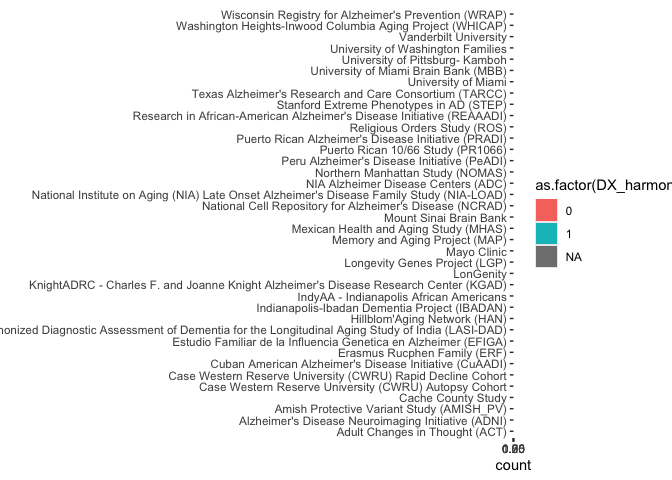<!-- -->

``` r
metadata %>% 
  ggplot(aes(x = Cohort)) +
  geom_bar() +
  coord_flip()
```

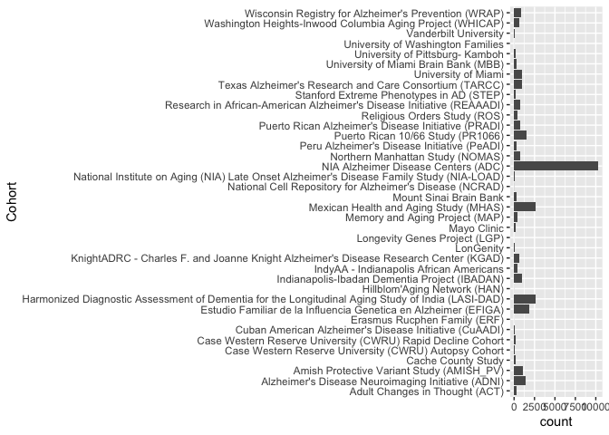<!-- -->

The diagnosis is NOT balanced across cohorts.

I will now create the phenotype file. The requirements from tractor are
the following:

–phenofile \[Mandatory\] Path to the file containing phenotype and
covariate data. Default assumptions: Sample ID column: “IID” or “\#IID”,
Phenotype column: “y”. If different column names are used, refer to
–sampleidcol and –phenocol arguments. All covariates MUST be included
using –covarcollist. tab-delimited

–covarcollist \[Mandatory\] Specify column names of covariates in the
–phenofile. Only listed columns will be included as covariates. Separate
multiple covariates with commas. E.g. –covarcollist age,sex,PC1,PC2. To
exclude covariates, specify “–covarcollist none”.

``` r
phenofile = metadata %>% 
  select(SampleID, DX_harmonized, Sex, Age_harmonized)
```

Now I will check the number of complete cases that we have.

``` r
mice::md.pattern(phenofile)
```

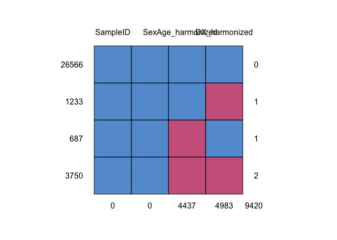<!-- -->

    ##       SampleID Sex Age_harmonized DX_harmonized     
    ## 26566        1   1              1             1    0
    ## 1233         1   1              1             0    1
    ## 687          1   1              0             1    1
    ## 3750         1   1              0             0    2
    ##              0   0           4437          4983 9420

We have 1233 with missing diagnosis. These will be removed.

We have 3750 with missing diagnosis and missing age. These will be
removed.

We have 687 with missing age.

We have 26566 complete cases.

I could impute the 687 samples with missing age, but since they
represent a very small proportion of the data set (2.5%), I will remove
them and work only with complete cases.

``` r
phenofile <- metadata %>% 
  select(SampleID, DX_harmonized, Age_harmonized, Sex) %>% 
  drop_na() %>% 
  rename(IID = SampleID, y = DX_harmonized) 

glimpse(phenofile)
```

    ## Rows: 26,566
    ## Columns: 4
    ## $ IID            <chr> "A-ACT-AC000014-BL-NCR-15AD78694", "A-ACT-AC000034-BL-N…
    ## $ y              <int> 0, 0, 1, 1, 1, 0, 1, 0, 1, 1, 0, 0, 1, 1, 0, 1, 0, 1, 1…
    ## $ Age_harmonized <dbl> 77, 68, 88, 90, 86, 79, 86, 70, 84, 90, 87, 77, 90, 86,…
    ## $ Sex            <int> 0, 0, 0, 1, 1, 1, 1, 1, 1, 1, 1, 1, 1, 0, 0, 1, 1, 1, 0…

Now I will add the global ancestry PCs

``` r
ga_pcs = read_table("gcad.qc.r4.wgs.36361.GATK.2025.05.07.PCA_allchr.txt")
```

    ## 
    ## ── Column specification ────────────────────────────────────────────────────────
    ## cols(
    ##   .default = col_double(),
    ##   sample.id = col_character()
    ## )
    ## ℹ Use `spec()` for the full column specifications.

``` r
# Now plot them
ga_pcs %>% 
  ggplot(aes(x = PC1, y = PC2)) +
  geom_point()
```

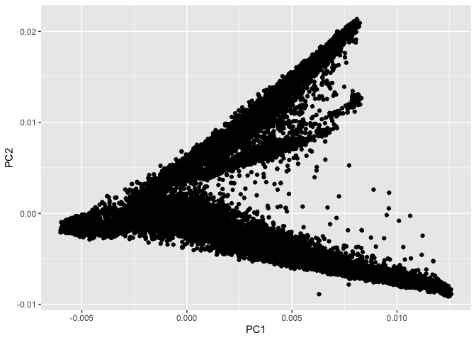<!-- -->

``` r
ga_pcs %>% 
  ggplot(aes(x = PC2, y = PC3)) +
  geom_point()
```

<!-- -->

``` r
ga_pcs %>% 
  ggplot(aes(x = PC3, y = PC4)) +
  geom_point() 
```

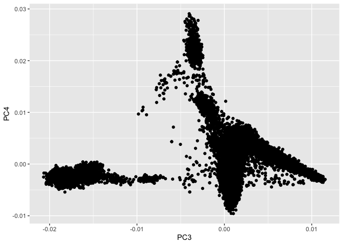<!-- -->

``` r
ga_pcs %>%
  ggplot(aes(x = PC4, y = PC5)) +
  geom_point()
```

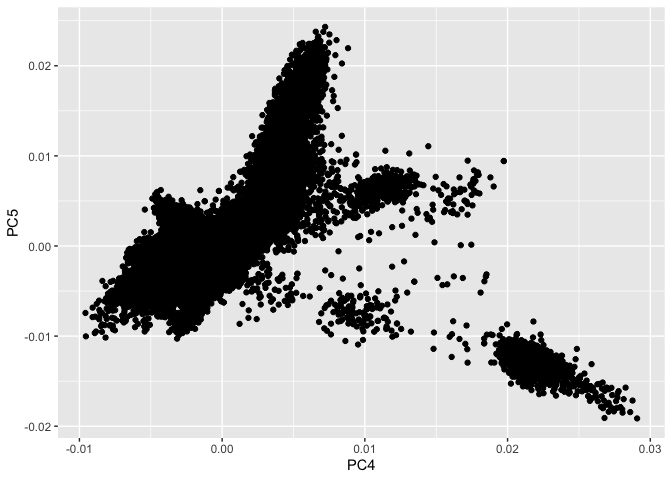<!-- -->

``` r
#PC 5 is already capturing displaying a cloud shape and not separating the individuals. 
ga_pcs %>%
  ggplot(aes(x = PC5, y = PC6)) +
  geom_point()
```

<!-- -->

``` r
#PC6 is already not capturing variance that separates the individuals, just a few of them, which is likely to be a local genomic structure. To avoid collider bias (https://pmc.ncbi.nlm.nih.gov/articles/PMC11684764/) I will stop at PC 3. 

#Now I will merge the PCs with the phenotype file

phenofile = phenofile %>% 
  left_join(ga_pcs %>% 
              rename(IID = sample.id) %>% 
              select(IID, PC1, PC2, PC3, PC4), 
            by = "IID") 

#Make sure there are no NAs
md.pattern(phenofile)
```

    ##  /\     /\
    ## {  `---'  }
    ## {  O   O  }
    ## ==>  V <==  No need for mice. This data set is completely observed.
    ##  \  \|/  /
    ##   `-----'

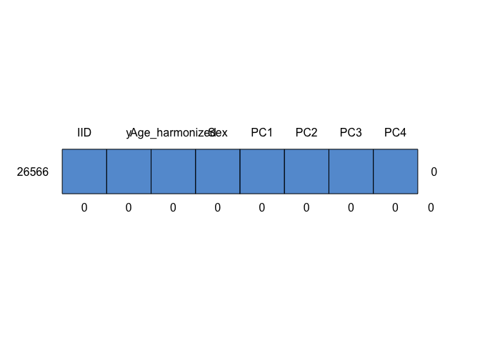<!-- -->

    ##       IID y Age_harmonized Sex PC1 PC2 PC3 PC4  
    ## 26566   1 1              1   1   1   1   1   1 0
    ##         0 0              0   0   0   0   0   0 0

Now, we will remove individuals that are related up to a 4th degree
relationship. I will load the object with the relatedness metric
provided by our collaborators.

``` r
library(readxl)
relatedness <- read_excel(here("step1.all_chromosome.pcrelate.0.022_2.xlsx"))
head(relatedness)
```

    ## # A tibble: 6 × 6
    ##   ID1                               ID2                kin    k0       k2   nsnp
    ##   <chr>                             <chr>            <dbl> <dbl>    <dbl>  <dbl>
    ## 1 A-MIA-UM011486-BL-MIA-201914597   A-MIA-UM011578… 0.0220 0.917  0.00543  59377
    ## 2 A-AMSH-AM000320-BL-MIA-200910861d A-AMSH-AM00032… 0.0220 0.916  0.00420 129928
    ## 3 A-AMSH-AM000622-BL-MIA-202009373v A-AMSH-AM00089… 0.0220 0.915  0.00322 131704
    ## 4 A-PRHS-PR000522-BL-COL-40350BL1   A-PRHS-PR00107… 0.0220 0.921  0.00871 141562
    ## 5 A-IIBD-IB000321-BL-NCR-14AD70995  A-IIBD-IB00092… 0.0220 0.905 -0.00653  78238
    ## 6 A-MIA-UM011506-BL-MIA-201915717   A-MIA-UM011604… 0.0220 0.921  0.00921  63142

Now I will make a graph to identify families. The object that I loaded
is already filtered so that it only contains the individuals with a
kinship coefficient \> 0.022 (4th degree relationship).

``` r
library(igraph)
```

    ## 
    ## Attaching package: 'igraph'

    ## The following objects are masked from 'package:lubridate':
    ## 
    ##     %--%, union

    ## The following objects are masked from 'package:dplyr':
    ## 
    ##     as_data_frame, groups, union

    ## The following objects are masked from 'package:purrr':
    ## 
    ##     compose, simplify

    ## The following object is masked from 'package:tidyr':
    ## 
    ##     crossing

    ## The following object is masked from 'package:tibble':
    ## 
    ##     as_data_frame

    ## The following objects are masked from 'package:stats':
    ## 
    ##     decompose, spectrum

    ## The following object is masked from 'package:base':
    ## 
    ##     union

``` r
g = graph_from_data_frame(relatedness %>% select(ID1,ID2), directed = FALSE)

#See how many families are there
components <- components(g)
components$no #How many families?
```

    ## [1] 2799

``` r
#There are 2799 families. Let's make this a df so that we can wrangle it
comp_df = data.frame(ID = names(components$membership), family = components$membership)

#Now let's remove individuals that are not present in the phenofile
comp_df = comp_df %>% 
  filter(ID %in% phenofile$IID)
#Now let's see how many families we have
length(unique(comp_df$family)) #We have 2546 families
```

    ## [1] 2546

``` r
#let's pick one individual per family and remove the rest from the phenofile 
set.seed(123)
individuals_to_keep = comp_df %>% 
  group_by(family) %>% 
  slice_sample(n = 1) %>% 
  pull(ID) 

length(individuals_to_keep) #We have 2546 individuals to keep
```

    ## [1] 2546

``` r
#Get the list of individuals to remove
individuals_to_remove = comp_df %>% 
  filter(!ID %in% individuals_to_keep) %>% 
  pull(ID)
length(individuals_to_remove) #We have 3547 individuals to remove
```

    ## [1] 3547

``` r
#Remove individuals from phenofile
phenofile = phenofile %>% 
  filter(!IID %in% individuals_to_remove)
nrow(phenofile) #We have 23019 individuals left
```

    ## [1] 23019

``` r
write_tsv(phenofile, here("phenofile.txt"), col_names = TRUE)
```

``` r
#Create demographic plot 
library(cowplot)
```

    ## 
    ## Attaching package: 'cowplot'

    ## The following object is masked from 'package:lubridate':
    ## 
    ##     stamp

``` r
library(patchwork)
```

    ## 
    ## Attaching package: 'patchwork'

    ## The following object is masked from 'package:cowplot':
    ## 
    ##     align_plots

``` r
p1 = phenofile %>%
   mutate(Diagnosis = case_when(y == 0 ~ "Controls",
                                y == 1 ~ "Cases")) %>%
   mutate(Sex = case_when(Sex == 0 ~ "Male", 
                          Sex == 1 ~ "Female")) %>% 
   ggplot(aes(x = Sex, fill = Sex)) + 
   geom_bar() +
  geom_text(stat = "count", aes(label = scales::comma(after_stat(count))), vjust = -0.5) +
  scale_y_continuous(expand = expansion(add = 2000))+
   facet_grid("Diagnosis", switch = "y")+
   theme_cowplot() + guides(fill = "none")

p2 = phenofile %>%
   mutate(Diagnosis = case_when(y == 0 ~ "Controls",
                                y == 1 ~ "Cases")) %>%
   mutate(Sex = case_when(Sex == 0 ~ "Male", 
                          Sex == 1 ~ "Female")) %>% 
   ggplot(aes(x = Age_harmonized, fill = Sex)) + 
   geom_histogram() +
   facet_grid("Diagnosis")+
   theme_cowplot()+
   xlab("Age")+
  guides(fill = "none")+
  theme(
  strip.background = element_blank(),
  strip.text.y = element_blank())

png("demographic_plot.png", width = 1800, height = 1000, res = 300)
print(p1 + p2)
```

    ## `stat_bin()` using `bins = 30`. Pick better value with `binwidth`.

``` r
dev.off()
```

    ## quartz_off_screen 
    ##                 2

I will now make a more detailed breakdown of the characteristics of our
samples. I will do it for both cases and controls.

``` r
#Table for controls
metadata = metadata %>% 
  mutate(Race = case_when(Race == "1" ~ "American Indian/Alaska Native",
                          Race == "2" ~ "Asian", 
                          Race == "3" ~ "Native Hawaiian or Other Pacific Islander",
                          Race == "4" ~ "Black or African American",
                          Race == "5" ~ "White", 
                          Race == "6" ~ "Other",
                          is.na(Race) ~ "Not reported"),
         Sex = case_when(Sex == 0 ~ "Male", 
                         Sex == 1 ~ "Female"),
         APOE_WGS = as.character(APOE_WGS))

controls = metadata %>% 
  filter(SampleID %in% phenofile$IID,
         DX_harmonized == 0) %>% 
  group_by(Race) %>% 
  summarize(
    n = n(),
    Age_mean = mean(Age_harmonized, na.rm = TRUE),
    Age_sd = sd(Age_harmonized, na.rm = TRUE),
    Females = sum(Sex == "Female"), 
    Females_prop = Females / n, 
    APOE_22 = sum(APOE_WGS == "22", na.rm = TRUE),
    APOE_23 = sum(APOE_WGS == "23", na.rm = TRUE),
    APOE_24 = sum(APOE_WGS == "24", na.rm = TRUE),
    APOE_33 = sum(APOE_WGS == "33", na.rm = TRUE),
    APOE_34 = sum(APOE_WGS == "34", na.rm = TRUE),
    APOE_44 = sum(APOE_WGS == "44", na.rm = TRUE),
    APOE_Unknown = sum(is.na(APOE_WGS), na.rm = TRUE) + sum(APOE_WGS == "14", na.rm = TRUE))

cases = metadata %>% 
  filter(SampleID %in% phenofile$IID,
         DX_harmonized == 1) %>% 
  group_by(Race) %>% 
  summarize(
    n = n(),
    Age_mean = mean(Age_harmonized, na.rm = TRUE),
    Age_sd = sd(Age_harmonized, na.rm = TRUE),
    Females = sum(Sex == "Female"), 
    Females_prop = Females / n, 
    APOE_22 = sum(APOE_WGS == "22", na.rm = TRUE),
    APOE_23 = sum(APOE_WGS == "23", na.rm = TRUE),
    APOE_24 = sum(APOE_WGS == "24", na.rm = TRUE),
    APOE_33 = sum(APOE_WGS == "33", na.rm = TRUE),
    APOE_34 = sum(APOE_WGS == "34", na.rm = TRUE),
    APOE_44 = sum(APOE_WGS == "44", na.rm = TRUE),
    APOE_Unknown = sum(is.na(APOE_WGS), na.rm = TRUE) + sum(APOE_WGS == "14", na.rm = TRUE))

# (controls = metadata %>% 
#   filter(SampleID %in% phenofile$IID,
#          DX_harmonized == 0) %>% 
#   group_by(Race) %>% 
#   summarise(
#     n = n()
#   ) %>%
#   mutate(Variable = "Race") %>%
#   dplyr::rename(Category = Race) %>%
#   bind_rows(metadata %>% 
#               filter(SampleID %in% phenofile$IID,
#                      DX_harmonized == 0) %>% 
#               group_by(Sex) %>% 
#               summarise(n = n()
#                         ) %>% 
#               mutate(Variable = "Sex") %>% 
#               dplyr::rename(Category = Sex)
#             ) %>% 
#   bind_rows(metadata %>% 
#               filter(SampleID %in% phenofile$IID,
#                      DX_harmonized == 0) %>% 
#               group_by(APOE_WGS) %>% 
#               summarise(n = n()
#                         ) %>% 
#               mutate(Variable = "APOE genotype") %>% 
#               dplyr::rename(Category = APOE_WGS) 
#             ))

#Now for cases 
# (cases = metadata %>% 
#   filter(SampleID %in% phenofile$IID)
#          DX_harmonized == 1) %>% 
#   group_by(Race) %>% 
#   summarise(
#     n = n()
#   ) %>%
#   mutate(Variable = "Race") %>%
#   dplyr::rename(Category = Race) %>%
#   bind_rows(metadata %>% 
#               filter(SampleID %in% phenofile$IID,
#                      DX_harmonized == 1) %>% 
#               group_by(Sex) %>% 
#               summarise(n = n()
#                         ) %>% 
#               mutate(Variable = "Sex") %>% 
#               dplyr::rename(Category = Sex)
#             ) %>% 
#   bind_rows(metadata %>% 
#               filter(SampleID %in% phenofile$IID,
#                      DX_harmonized == 1) %>% 
#               group_by(APOE_WGS) %>% 
#               summarise(n = n()
#                         ) %>% 
#               mutate(Variable = "APOE genotype") %>% 
#               dplyr::rename(Category = APOE_WGS) 
#             ))
```

### Run GWAS

First I need to set up the environment to run the analysis

``` bash
cd /scratch/st-kdkortha-1/enavarro/pgrn_local_ancestry/Tractor
module load gcc python miniconda3 cuda cudnn
conda env create -f conda_py3_tractor.yml
```

I also have to install the R packages needed for the script to run

``` bash
cd /scratch/st-kdkortha-1/enavarro/pgrn_local_ancestry/
module load miniconda3
source ~/.bashrc
conda activate py3_tractor
conda install -c conda-forge r-dplyr
conda install -c conda-forge r-data.table

#Now install the rest of the packages in R 
R
```

``` r
install.packages('optparse')
install.packages('R.utils')
install.packages('doParallel')
```

Now that I have all the needed packages installed, I will run the
following script:

``` bash
#!/bin/bash
#SBATCH --time=72:00:00 # Request 24 hours of runtime
#SBATCH --account=st-kdkortha-1 # Specify your allocation code
#SBATCH --nodes=1 # Request 1 node
#SBATCH --ntasks=1 # Request 1 task
#SBATCH --mem=320G # Request 160 GB of memory
#SBATCH --cpus-per-task=20
#SBATCH --job-name=tractor_gwas # Specify the job name
#SBATCH -e tractor_gwas-%j.err # Specify the error file. The %j will be replaced by the Slurm job id.
#SBATCH -o tractor_gwas-%j.out # Specify the output file
#SBATCH --mail-user=erick.navarrodelgado@bcchr.ca  # Email address for job notifications
#SBATCH --mail-type=ALL

cd /scratch/st-kdkortha-1/enavarro/pgrn_local_ancestry/Tractor/scripts

#Activate conda environment 
module load miniconda3
source ~/.bashrc
source activate /home/ericknav/.conda/envs/py3_tractor

./run_tractor.R \
--hapdose ../../data/chr17_subset_v10_hg38_phased \
--phenofile ../../data/phenofile.txt \
--covarcollist Age_harmonized,Sex,PC1,PC2,PC3,PC4 \
--method linear \
--output ../../results/tractor_res_PCs1_4_nokin.txt \
--sampleidcol IID \
--phenocol y \
--chunksize 10000 \
--nthreads 10
```

See logs

``` bash
cd /scratch/st-kdkortha-1/enavarro/pgrn_local_ancestry/source
less tractor_gwas-6199539.out 
```

    ## bash: line 0: cd: /scratch/st-kdkortha-1/enavarro/pgrn_local_ancestry/source: No such file or directory
    ## tractor_gwas-6199539.out: No such file or directory

Tractor Script Version : 1.4.0 Sample ID column used : IID Phenotype
column used : y Covariates used : Age_harmonized Sex PC1 PC2 PC3 PC4
Total hapcount/dosage files identified : 10
../../data/chr17_subset_v10_hg38_phased.anc0.hapcount.txt.gz
../../data/chr17_subset_v10_hg38_phased.anc1.hapcount.txt.gz
../../data/chr17_subset_v10_hg38_phased.anc2.hapcount.txt.gz
../../data/chr17_subset_v10_hg38_phased.anc3.hapcount.txt.gz
../../data/chr17_subset_v10_hg38_phased.anc4.hapcount.txt.gz
../../data/chr17_subset_v10_hg38_phased.anc0.dosage.txt.gz
../../data/chr17_subset_v10_hg38_phased.anc1.dosage.txt.gz
../../data/chr17_subset_v10_hg38_phased.anc2.dosage.txt.gz
../../data/chr17_subset_v10_hg38_phased.anc3.dosage.txt.gz
../../data/chr17_subset_v10_hg38_phased.anc4.dosage.txt.gz Total SNPs
Identified : 302666 Threads being used : 9 Total samples : 36361 (from
hapcount/dosage files)

Chunk 1/31 completed. 2025-09-17 15:59:15.75077 Chunk 2/31 completed.
2025-09-17 17:21:23.28315 Chunk 3/31 completed. 2025-09-17
18:45:08.930552 Chunk 4/31 completed. 2025-09-17 20:09:20.276412 Chunk
5/31 completed. 2025-09-17 21:33:38.697963 Chunk 6/31 completed.
2025-09-17 22:58:49.320786 Chunk 7/31 completed. 2025-09-18
00:23:56.224615 Chunk 8/31 completed. 2025-09-18 01:49:34.24075 Chunk
9/31 completed. 2025-09-18 03:15:52.39693 Chunk 10/31 completed.
2025-09-18 04:42:36.7496 Chunk 11/31 completed. 2025-09-18 06:09:22.5365
Chunk 12/31 completed. 2025-09-18 07:37:40.163333 Chunk 13/31 completed.
2025-09-18 09:05:45.350492 Chunk 14/31 completed. 2025-09-18
10:33:55.355489 Chunk 15/31 completed. 2025-09-18 12:03:04.246485 Chunk
16/31 completed. 2025-09-18 13:32:59.505804 Chunk 17/31 completed.
2025-09-18 15:03:45.598963 Chunk 18/31 completed. 2025-09-18
16:34:44.246872 Chunk 19/31 completed. 2025-09-18 18:05:58.678129 Chunk
20/31 completed. 2025-09-18 19:37:39.705664 Chunk 21/31 completed.
2025-09-18 21:10:37.329079 Chunk 22/31 completed. 2025-09-18
22:43:34.541644 Chunk 23/31 completed. 2025-09-19 00:16:31.487981 Chunk
24/31 completed. 2025-09-19 01:50:01.296258 Chunk 25/31 completed.
2025-09-19 03:23:31.504153 Chunk 26/31 completed. 2025-09-19
04:58:16.247853 Chunk 27/31 completed. 2025-09-19 06:32:49.323684 Chunk
28/31 completed. 2025-09-19 08:09:20.383857 Chunk 29/31 completed.
2025-09-19 09:45:51.316572 Chunk 30/31 completed. 2025-09-19
11:22:51.918178 Chunk 31/31 completed. 2025-09-19 12:25:08.593934 Run
complete.

Get the exact samples that were used in the analysis

``` r
samples = read_tsv(here("phenofile.txt"), col_names = TRUE) %>% 
  select(IID)
```

    ## Rows: 23019 Columns: 8
    ## ── Column specification ────────────────────────────────────────────────────────
    ## Delimiter: "\t"
    ## chr (1): IID
    ## dbl (7): y, Age_harmonized, Sex, PC1, PC2, PC3, PC4
    ## 
    ## ℹ Use `spec()` to retrieve the full column specification for this data.
    ## ℹ Specify the column types or set `show_col_types = FALSE` to quiet this message.

``` r
write_tsv(samples, here("samples.txt"), col_names = TRUE)
```

### See results

``` r
library(tidyverse)
library(here)
library(ggrepel)
library(cowplot)

tractor_res <- read_delim("results/tractor_res_PCs1_4_nokin.txt", 
     delim = "\t", escape_double = FALSE, 
     trim_ws = TRUE)
```

    ## Rows: 302666 Columns: 44
    ## ── Column specification ────────────────────────────────────────────────────────
    ## Delimiter: "\t"
    ## chr  (4): CHR, ID, REF, ALT
    ## dbl (40): POS, N, AF_anc0, LAprop_anc0, beta_anc0, se_anc0, pval_anc0, tval_...
    ## 
    ## ℹ Use `spec()` to retrieve the full column specification for this data.
    ## ℹ Specify the column types or set `show_col_types = FALSE` to quiet this message.

``` r
(snp_interest = tractor_res %>% 
  filter(ID == "rs5848") %>% 
  select(contains("anc")) %>%
  pivot_longer(cols = everything(), names_to = c(".value","Ancestry"), names_pattern = "(.+)_(.*$)") %>% 
  mutate(p_adjusted = p.adjust(pval, method = "bonferroni" )) %>% 
  mutate(Ancestry = case_when(Ancestry == "anc0" ~ "AFR", 
                                  Ancestry == "anc1" ~ "AMR", 
                                  Ancestry == "anc2" ~ "EAS", 
                                  Ancestry == "anc3" ~ "EUR", 
                                  Ancestry == "anc4" ~ "SAS")) %>% 
  arrange(p_adjusted) %>% 
  select(Ancestry, pval, p_adjusted, everything()))
```

    ## # A tibble: 5 × 10
    ##   Ancestry     pval p_adjusted    AF LAprop      beta     se    tval      LApval
    ##   <chr>       <dbl>      <dbl> <dbl>  <dbl>     <dbl>  <dbl>   <dbl>       <dbl>
    ## 1 EAS      0.000409    0.00205 0.186 0.0362  0.0954   0.027   3.53       5.91e-8
    ## 2 EUR      0.0125      0.0623  0.281 0.616   0.0152   0.0061  2.50       5.26e-5
    ## 3 AFR      0.434       1       0.753 0.185   0.00864  0.011   0.783      7.58e-5
    ## 4 AMR      0.539       1       0.121 0.0804 -0.0132   0.0215 -0.614      2.57e-4
    ## 5 SAS      0.998       1       0.357 0.0817 -0.000026 0.0137 -0.0019    NA      
    ## # ℹ 1 more variable: LAeff <dbl>

``` r
#Plot the results
(plot_rs5848= snp_interest %>% 
  mutate(significant = p_adjusted < 0.05) %>%
  ggplot(aes(x = beta, y = -log10(pval), color = significant)) +
  geom_point() +
  geom_point(shape = 23, size = 3) +
  geom_text_repel(aes(label = Ancestry), nudge_y = 0.1) +
  xlab("Coefficient") +
  ylab("-log10(p val)") +
  geom_hline(yintercept = -log10(0.05/5), linetype = "dashed") +
  cowplot::theme_cowplot() +
  scale_color_manual(values = c("TRUE" = "red", "FALSE" = "black")) +
  guides(color= "none"))
```

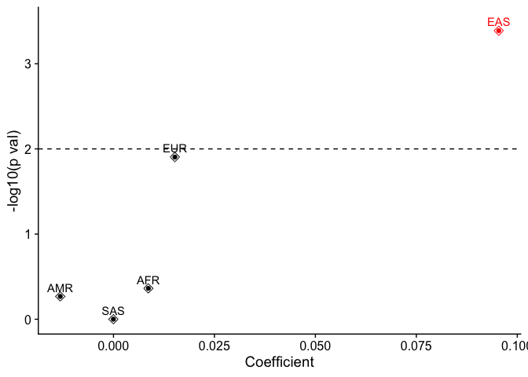<!-- -->

``` r
#save plot
png(here("results/plot_rs5848.png"),
    units="in", width=4, height=3, res=300)
print(plot_rs5848)
dev.off()
```

    ## quartz_off_screen 
    ##                 2

``` r
#save results
write.csv(snp_interest, here("results/results_rs5848.csv"), row.names = FALSE, quote = FALSE)

region_interest = tractor_res %>% 
  filter(POS %in% c(44337379:44353435)) %>% #243 SNPs
  pivot_longer(cols = -c(CHR:N), names_to = c(".value","Ancestry"), names_pattern = "(.+)_(.*$)") %>% 
  mutate(n_risk_alleles = round(2*N*AF*LAprop)) %>% 
  filter(AF > 0.005) %>% 
  mutate(Ancestry = case_when(Ancestry == "anc0" ~ "AFR", 
                                  Ancestry == "anc1" ~ "AMR", 
                                  Ancestry == "anc2" ~ "EAS", 
                                  Ancestry == "anc3" ~ "EUR", 
                                  Ancestry == "anc4" ~ "SAS")) %>%
  mutate(ID_unique = paste(CHR, POS, sep = ":")) %>% 
  mutate(p_adj = pval*length(unique(ID_unique)),#Adjust with bonferroni for the total number of sites tested
         significant = p_adj < 0.05)

# region_interest = tractor_res %>% 
#   filter(POS %in% c(44337379:44353435)) %>% #243 SNPs
#   pivot_longer(cols = -c(CHR:N), names_to = c(".value","Ancestry"), names_pattern = "(.+)_(.*$)") %>% 
#   mutate(n_risk_alleles = round(2*N*AF*LAprop)) %>% 
#   filter(AF > 0.005) %>% 
#   mutate(Ancestry = case_when(Ancestry == "anc0" ~ "AFR", 
#                                   Ancestry == "anc1" ~ "AMR", 
#                                   Ancestry == "anc2" ~ "EAS", 
#                                   Ancestry == "anc3" ~ "EUR", 
#                                   Ancestry == "anc4" ~ "SAS")) %>%
#   mutate(ID_unique = paste(CHR, POS, sep = ":")) %>% 
#   group_by(Ancestry) %>% 
#   mutate(p_adj = p.adjust(pval, method = "BH"),#Adjust with bonferroni for the total number of sites tested
#          significant = p_adj < 0.05)

(plot_region = region_interest %>% 
  ggplot(aes(x = POS, y = -log10(pval), labels = ID, color = significant)) +
  geom_point()+
  geom_text_repel(data = region_interest %>% filter(significant), aes(label = ID)) +
  geom_point(data = region_interest %>% filter(ID == "rs5848"), shape = 23, size = 3) +
  geom_hline(yintercept = -log10(0.05/length(unique(region_interest$ID_unique))), linetype = "dashed") +
  facet_wrap(~Ancestry) +
  cowplot::theme_cowplot() + 
  scale_x_continuous(breaks = c(44341000, 44350000 ), labels = scales::comma)+
  scale_color_manual(values = c("TRUE" = "red", "FALSE" = "black")) +
  xlab("Position (chr17)") +
  guides(color= "none"))
```

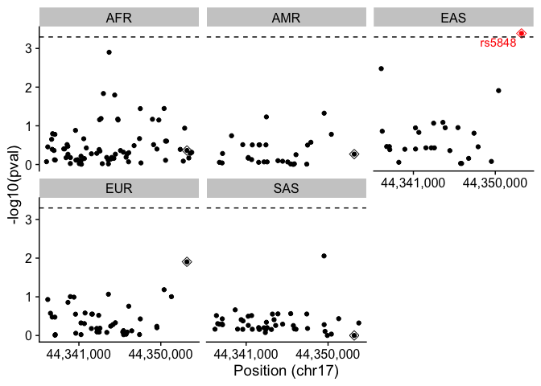<!-- -->

``` r
#Save plot
png(here("results/plot_region.png"),
    units="in", width=6, height=4.5, res=300)
print(plot_region)
dev.off()
```

    ## quartz_off_screen 
    ##                 2

``` r
#See top 5 hits per ancestry
(top_hits = region_interest %>% 
  group_by(Ancestry) %>% 
  arrange(pval) %>% 
  slice_head(n = 5) %>% 
  mutate(POS = paste(CHR, POS, sep = ":")) %>% 
  select(Ancestry, ID, POS, pval, p_adj))
```

    ## # A tibble: 25 × 5
    ## # Groups:   Ancestry [5]
    ##    Ancestry ID          POS               pval  p_adj
    ##    <chr>    <chr>       <chr>            <dbl>  <dbl>
    ##  1 AFR      rs67376473  chr17:44344321 0.00126  0.124
    ##  2 AFR      rs149391563 chr17:44343693 0.0146   1.45 
    ##  3 AFR      rs145190823 chr17:44344932 0.0160   1.59 
    ##  4 AFR      rs850713    chr17:44350364 0.0357   3.54 
    ##  5 AFR      rs146364320 chr17:44347746 0.0360   3.56 
    ##  6 AMR      rs9897526   chr17:44349572 0.0473   4.68 
    ##  7 AMR      rs72824731  chr17:44343224 0.0590   5.84 
    ##  8 AMR      rs850713    chr17:44350364 0.166   16.4  
    ##  9 AMR      .           chr17:44339396 0.181   17.9  
    ## 10 AMR      rs117883091 chr17:44348113 0.266   26.4  
    ## # ℹ 15 more rows

``` r
#Nothing intersting pops out other than rs5848 

#save results
write.csv(region_interest, here("results/results_region.csv"), row.names = FALSE, quote = FALSE)
```

In addition to that, one of the reviewers asked us to do a sensitivity
analysis extending the window to 10kb to the 3’ end. I will subset those
results and make a plot.

``` r
region_interest_sensitivity = tractor_res %>% 
  filter(POS %in% c(44337379:44363435)) %>% 
  pivot_longer(cols = -c(CHR:N), names_to = c(".value","Ancestry"), names_pattern = "(.+)_(.*$)") %>% 
  mutate(n_risk_alleles = round(2*N*AF*LAprop)) %>% 
  filter(AF > 0.005) %>% 
  mutate(Ancestry = case_when(Ancestry == "anc0" ~ "AFR", 
                                  Ancestry == "anc1" ~ "AMR", 
                                  Ancestry == "anc2" ~ "EAS", 
                                  Ancestry == "anc3" ~ "EUR", 
                                  Ancestry == "anc4" ~ "SAS")) %>%
  mutate(ID_unique = paste(CHR, POS, sep = ":")) %>% 
  mutate(p_adj = pval*length(unique(ID_unique)),#Adjust with bonferroni for the total number of sites tested
         significant = p_adj < 0.05)


(plot_region_s = region_interest_sensitivity %>% 
  ggplot(aes(x = POS, y = -log10(pval), labels = ID, color = significant)) +
  geom_point()+
  geom_text_repel(data = region_interest_sensitivity %>% filter(significant), aes(label = ID)) +
  geom_point(data = region_interest_sensitivity %>% filter(ID == "rs5848"), shape = 23, size = 3) +
  geom_hline(yintercept = -log10(0.05/length(unique(region_interest_sensitivity$ID_unique))), linetype = "dashed") +
  facet_wrap(~Ancestry) +
  cowplot::theme_cowplot() + 
  scale_x_continuous(breaks = c(44343000, 44359000 ), labels = scales::comma)+
  scale_color_manual(values = c("TRUE" = "red", "FALSE" = "black")) +
  xlab("Position (chr17)") +
  guides(color= "none", x =  guide_axis(angle = 0)))
```

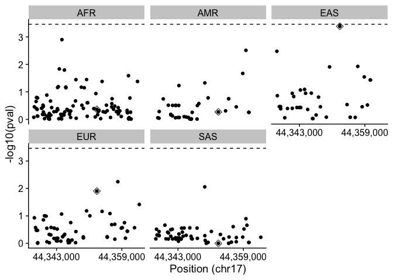<!-- -->

``` r
#Save plot
png(here("results/plot_region_sens.png"),
    units="in", width=6, height=4.5, res=300)
print(plot_region_s)
dev.off()
```

    ## quartz_off_screen 
    ##                 2

``` r
#save results
write.csv(region_interest_sensitivity, here("results/results_region_sens.csv"), row.names = FALSE, quote = FALSE)
```

### Plot demographics

Now we will create a plot that summarizes the local ancestry of the
individuals within the regulatory region of the progranulin gene.

``` r
#Load global ancestry estimates from rfmix
ancestry_proportions <- read_table("results/rfmix_results.rfmix.Q")
```

    ## 
    ## ── Column specification ────────────────────────────────────────────────────────
    ## cols(
    ##   sample = col_character(),
    ##   AFR = col_double(),
    ##   AMR = col_double(),
    ##   EAS = col_double(),
    ##   EUR = col_double(),
    ##   SAS = col_double()
    ## )

``` r
#Load phenofile
phenofile = read_table( here("phenofile.txt")) %>% 
  dplyr::rename(DX = y,
                sample = IID)
```

    ## 
    ## ── Column specification ────────────────────────────────────────────────────────
    ## cols(
    ##   IID = col_character(),
    ##   y = col_double(),
    ##   Age_harmonized = col_double(),
    ##   Sex = col_double(),
    ##   PC1 = col_double(),
    ##   PC2 = col_double(),
    ##   PC3 = col_double(),
    ##   PC4 = col_double()
    ## )

``` r
factor_order = ancestry_proportions %>% 
  arrange(desc(EUR), desc(AFR), desc(AMR), desc(SAS), desc(EAS)) %>% 
  pull(sample)

#Get the ancestry proportions on average in the whole dataset
ancestry_proportions %>% 
  filter(sample %in% phenofile$sample) %>% 
  column_to_rownames(var = "sample") %>%
  colMeans() %>%
  sort() %>% 
  round(4)
```

    ##    EAS    SAS    AMR    AFR    EUR 
    ## 0.0222 0.0981 0.1139 0.1943 0.5715

``` r
# color blind friendly palette with black:
cbbPalette <- c("#F0E442",  "#009E73", "#56B4E9", "#E69F00", "#999999")

### Test if the proportions of ancestry are different between cases and controls
cases = ancestry_proportions %>% 
  right_join(phenofile %>% 
              select(sample, DX), by = "sample") %>% 
  filter(DX == 1)

controls = ancestry_proportions %>%
  right_join(phenofile %>% 
              select(sample, DX), by = "sample") %>% 
  filter(DX == 0)

#Perform a t-test for each ancestry proportion
t.test(cases$AFR, controls$AFR)
```

    ## 
    ##  Welch Two Sample t-test
    ## 
    ## data:  cases$AFR and controls$AFR
    ## t = -10.804, df = 21585, p-value < 2.2e-16
    ## alternative hypothesis: true difference in means is not equal to 0
    ## 95 percent confidence interval:
    ##  -0.05727304 -0.03968318
    ## sample estimates:
    ## mean of x mean of y 
    ## 0.1656228 0.2141009

``` r
t.test(cases$AMR, controls$AMR)
```

    ## 
    ##  Welch Two Sample t-test
    ## 
    ## data:  cases$AMR and controls$AMR
    ## t = -29.365, df = 22756, p-value < 2.2e-16
    ## alternative hypothesis: true difference in means is not equal to 0
    ## 95 percent confidence interval:
    ##  -0.09116497 -0.07975617
    ## sample estimates:
    ##  mean of x  mean of y 
    ## 0.06338996 0.14885053

``` r
t.test(cases$EAS, controls$EAS)
```

    ## 
    ##  Welch Two Sample t-test
    ## 
    ## data:  cases$EAS and controls$EAS
    ## t = -7.4436, df = 17678, p-value = 1.024e-13
    ## alternative hypothesis: true difference in means is not equal to 0
    ## 95 percent confidence interval:
    ##  -0.009447744 -0.005509206
    ## sample estimates:
    ##  mean of x  mean of y 
    ## 0.01780416 0.02528263

``` r
t.test(cases$EUR, controls$EUR)
```

    ## 
    ##  Welch Two Sample t-test
    ## 
    ## data:  cases$EUR and controls$EUR
    ## t = 51.136, df = 21393, p-value < 2.2e-16
    ## alternative hypothesis: true difference in means is not equal to 0
    ## 95 percent confidence interval:
    ##  0.2491337 0.2689937
    ## sample estimates:
    ## mean of x mean of y 
    ## 0.7246017 0.4655380

``` r
t.test(cases$SAS, controls$SAS)
```

    ## 
    ##  Welch Two Sample t-test
    ## 
    ## data:  cases$SAS and controls$SAS
    ## t = -39.999, df = 18631, p-value < 2.2e-16
    ## alternative hypothesis: true difference in means is not equal to 0
    ## 95 percent confidence interval:
    ##  -0.1234116 -0.1118815
    ## sample estimates:
    ##  mean of x  mean of y 
    ## 0.02858145 0.14622797

``` r
(demographics_plot = ancestry_proportions %>% 
  right_join(phenofile %>% 
              select(sample, DX), by = "sample") %>%
  mutate(DX = case_when(DX == 0 ~ "Controls (n = 13,603)",
                        DX == 1 ~ "Cases (n = 9,416)")) %>%
  mutate(sample = factor(sample, levels = factor_order)) %>%
  droplevels() %>% 
  pivot_longer(cols = -c(sample, DX), names_to = "Ancestry", values_to = "Proportion") %>%
  mutate(Ancestry = factor(Ancestry, levels = c("EAS", "SAS", "AMR", "AFR", "EUR"))) %>%  #Reorder based on most frequent ancestry proportions
  ggplot(aes(x = sample, y = Proportion, fill = Ancestry)) +
  geom_col(width = 1) +
  scale_fill_manual(values = cbbPalette )+
  theme_cowplot() + 
  scale_y_continuous(
    # don't expand y scale at the lower end
    expand = expansion(mult = c(0, 0.05))
  ) +
  theme(axis.text.x=element_blank(), axis.ticks.x=element_blank()) +
  facet_grid(~DX, scales = "free_x", space = "free_x" ))
```

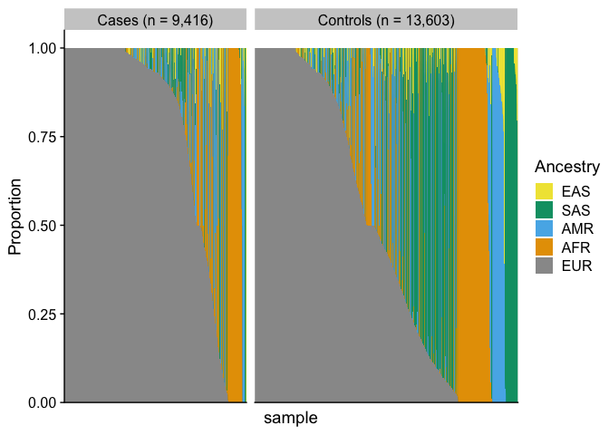<!-- -->

``` r
#Save plot
png(here("results/demographics_plot.png"),
    units="in", width=8, height=3, res=300)
print(demographics_plot)
dev.off()
```

    ## quartz_off_screen 
    ##                 2

``` r
#Get an average of ancestries on the whole population
average_ancestries_cases = ancestry_proportions %>% 
  filter(sample %in% (phenofile %>% 
                        filter(DX == 1) %>% 
                        pull(sample))) %>%
  mutate(sample = factor(sample, levels = factor_order)) %>%
  droplevels() %>% 
  column_to_rownames(var = "sample") %>% 
  t() %>% 
  as.data.frame() %>% 
  rowMeans() %>% 
  sort()
#Pie chart
slices_cases <- average_ancestries_cases
lbls_cases <- names(average_ancestries_cases)
pie(slices_cases, labels = lbls_cases, main="Average individual ancestry proportions (cases)", col = cbbPalette)
```

<!-- -->

``` r
#Save plot
png(here("results/pie_aver_ances_cases.png"),
    units="in", width=6, height=4, res=300)
pie(slices_cases, labels = lbls_cases, main="Average individual ancestry proportions (cases)", col = cbbPalette)
dev.off()
```

    ## quartz_off_screen 
    ##                 2

``` r
#Get an average of ancestries on the whole population controls
average_ancestries_controls = ancestry_proportions %>% 
  filter(sample %in% (phenofile %>% 
                        filter(DX == 0) %>% 
                        pull(sample))) %>%
  mutate(sample = factor(sample, levels = factor_order)) %>%
  droplevels() %>% 
  column_to_rownames(var = "sample") %>% 
  t() %>% 
  as.data.frame() %>% 
  rowMeans() %>% 
  sort()
#Pie chart
slices_controls <- average_ancestries_controls
lbls_controls <- names(average_ancestries_controls)
pie(slices_controls, labels = lbls_controls, main="Average individual ancestry proportions (controls)", col = cbbPalette)
```

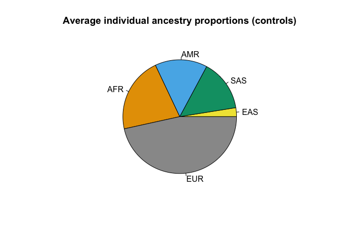<!-- -->

``` r
#Save plot
png(here("results/pie_aver_ances_controls.png"),
    units="in", width=6, height=4, res=300)
pie(slices_controls, labels = lbls_controls, main="Average individual ancestry proportions (controls)", col = cbbPalette)
dev.off() 
```

    ## quartz_off_screen 
    ##                 2

## Tools to cite

- Shapeit4
- bcftools
- rfmix
- Tractor

## R environment

``` r
sessionInfo()
```

    ## R version 4.4.2 (2024-10-31)
    ## Platform: aarch64-apple-darwin20
    ## Running under: macOS Sequoia 15.6
    ## 
    ## Matrix products: default
    ## BLAS:   /Library/Frameworks/R.framework/Versions/4.4-arm64/Resources/lib/libRblas.0.dylib 
    ## LAPACK: /Library/Frameworks/R.framework/Versions/4.4-arm64/Resources/lib/libRlapack.dylib;  LAPACK version 3.12.0
    ## 
    ## locale:
    ## [1] en_US.UTF-8/en_US.UTF-8/en_US.UTF-8/C/en_US.UTF-8/en_US.UTF-8
    ## 
    ## time zone: America/Vancouver
    ## tzcode source: internal
    ## 
    ## attached base packages:
    ## [1] stats     graphics  grDevices utils     datasets  methods   base     
    ## 
    ## other attached packages:
    ##  [1] ggrepel_0.9.6      patchwork_1.3.0    cowplot_1.2.0      igraph_2.1.4      
    ##  [5] readxl_1.4.3       mice_3.17.0        DataExplorer_0.8.3 here_1.0.1        
    ##  [9] lubridate_1.9.3    forcats_1.0.0      stringr_1.5.1      dplyr_1.1.4       
    ## [13] purrr_1.1.0        readr_2.1.5        tidyr_1.3.1        tibble_3.3.0      
    ## [17] ggplot2_3.5.2      tidyverse_2.0.0   
    ## 
    ## loaded via a namespace (and not attached):
    ##  [1] tidyselect_1.2.1   farver_2.1.2       fastmap_1.2.0      digest_0.6.37     
    ##  [5] rpart_4.1.23       timechange_0.3.0   lifecycle_1.0.4    survival_3.7-0    
    ##  [9] magrittr_2.0.3     compiler_4.4.2     rlang_1.1.6        tools_4.4.2       
    ## [13] utf8_1.2.6         yaml_2.3.10        data.table_1.17.8  knitr_1.50        
    ## [17] labeling_0.4.3     htmlwidgets_1.6.4  bit_4.6.0          RColorBrewer_1.1-3
    ## [21] withr_3.0.2        nnet_7.3-19        grid_4.4.2         jomo_2.7-6        
    ## [25] data.tree_1.1.0    scales_1.4.0       iterators_1.0.14   MASS_7.3-61       
    ## [29] cli_3.6.5          rmarkdown_2.29     crayon_1.5.3       reformulas_0.4.1  
    ## [33] generics_0.1.4     rstudioapi_0.17.1  tzdb_0.5.0         minqa_1.2.8       
    ## [37] splines_4.4.2      parallel_4.4.2     cellranger_1.1.0   vctrs_0.6.5       
    ## [41] boot_1.3-31        glmnet_4.1-9       Matrix_1.7-1       jsonlite_2.0.0    
    ## [45] hms_1.1.3          bit64_4.6.0-1      mitml_0.4-5        foreach_1.5.2     
    ## [49] glue_1.8.0         nloptr_2.2.1       pan_1.9            codetools_0.2-20  
    ## [53] stringi_1.8.7      shape_1.4.6.1      gtable_0.3.6       lme4_1.1-37       
    ## [57] pillar_1.11.0      htmltools_0.5.8.1  R6_2.6.1           networkD3_0.4.1   
    ## [61] Rdpack_2.6.4       rprojroot_2.0.4    vroom_1.6.5        evaluate_1.0.4    
    ## [65] lattice_0.22-6     rbibutils_2.3      backports_1.5.0    broom_1.0.7       
    ## [69] Rcpp_1.1.0         gridExtra_2.3      nlme_3.1-166       xfun_0.52         
    ## [73] pkgconfig_2.0.3
